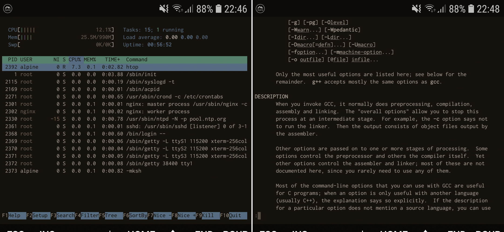

# Alpine Term

> Basically a text-based frontend to QEMU on Android OS.

*Telegram channel: https://t.me/alpineterm*

Alpine Term, aka Alpine Linux Terminal, is a virtual machine running the
[Alpine Linux](https://alpinelinux.org) — a security-oriented, lightweight
Linux distribution based on Musl libc and Busybox. Application started as
[Termux](https://termux.com) fork, aims to cover as much as possible of its
functionality as well as provide an experience of the true Linux-based system.

VM setup details:
- QEMU monitor console to manage VM.
- CPU: emulated 4-core (3 cores offline by default) x86 64-bit. (1\*)
- RAM (2\*): 32% of host memory + 8% for QEMU TCG buffers.
- HDD: 128 GB, paritioned & bootable.
- Optional support for custom HDD/CD-ROM images.
- Host storage: via 9P file system, mount tag `shared_storage`.
- Network: user-mode via SLiRP.
- Operating system: [Alpine Linux](https://alpinelinux.org/) installed on HDD
  with lots of packages.

1. *Emulated CPU has only one core online by default. Having more is pointless
   from the performance side because QEMU internally handles them in a one thread.*
2. *RAM allocations beyond 40% - 50% are not safe due to increased probability
   that Android will kill application to reclaim memory.*

Requires a high-end device with at least 6 GB of space on internal storage and
also some knowledge in the shell scripting and Linux system administration.

**Disclaimer**: neither Alpine Term application nor its author is affiliated
with the [Alpine Linux](https://alpinelinux.org/) project. Operating system
is provided as-is and vShell author is not responsible about bugs in the
software packages.

## Credits

Alpine Term relies on the source code of the following projects:

 - [Termux](https://github.com/termux/termux-app)
 - [QEMU](https://qemu.org)
 - [Socat](http://www.dest-unreach.org/socat/)
